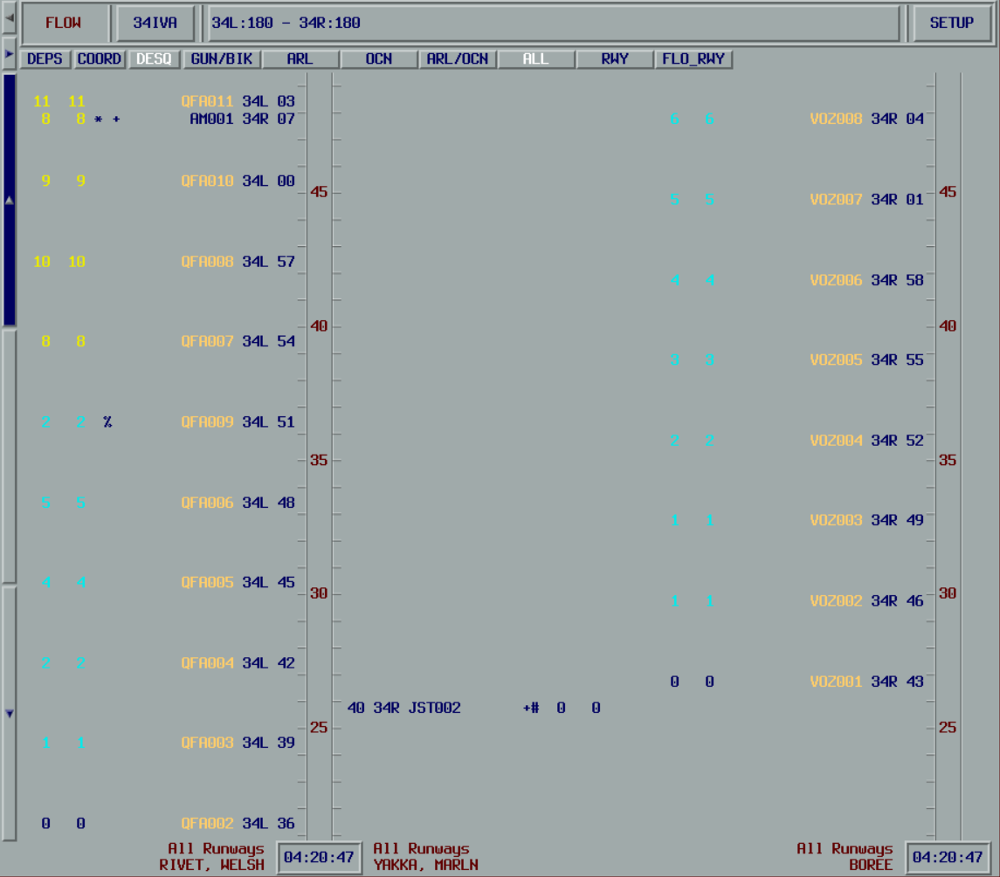

<h1 align="center">
  vMaestro
</h1>

<h3 align="center">
  A vatSys plugin emulating the Maestro Traffic Flow Management System.

  
  
  
  

  
</h3>

vMaestro is a [vatSys](https://virtualairtrafficsystem.com) plugin that emulates the Maestro Traffic Flow Management System used by air traffic controllers. It provides automated aircraft sequencing, runway assignment, and traffic flow management capabilities for virtual ATC operations.

## Documentation

For installation instructions, configuration guides, and usage documentation, visit:

**[https://maestro.eoinmotherway.dev/](https://maestro.eoinmotherway.dev/)**
