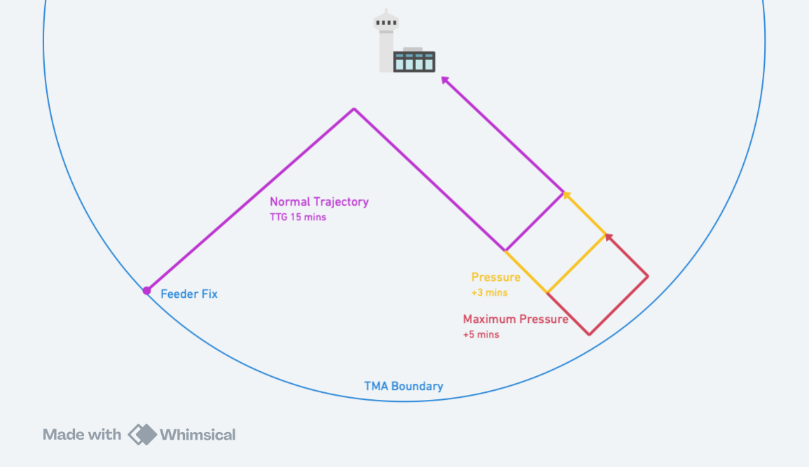
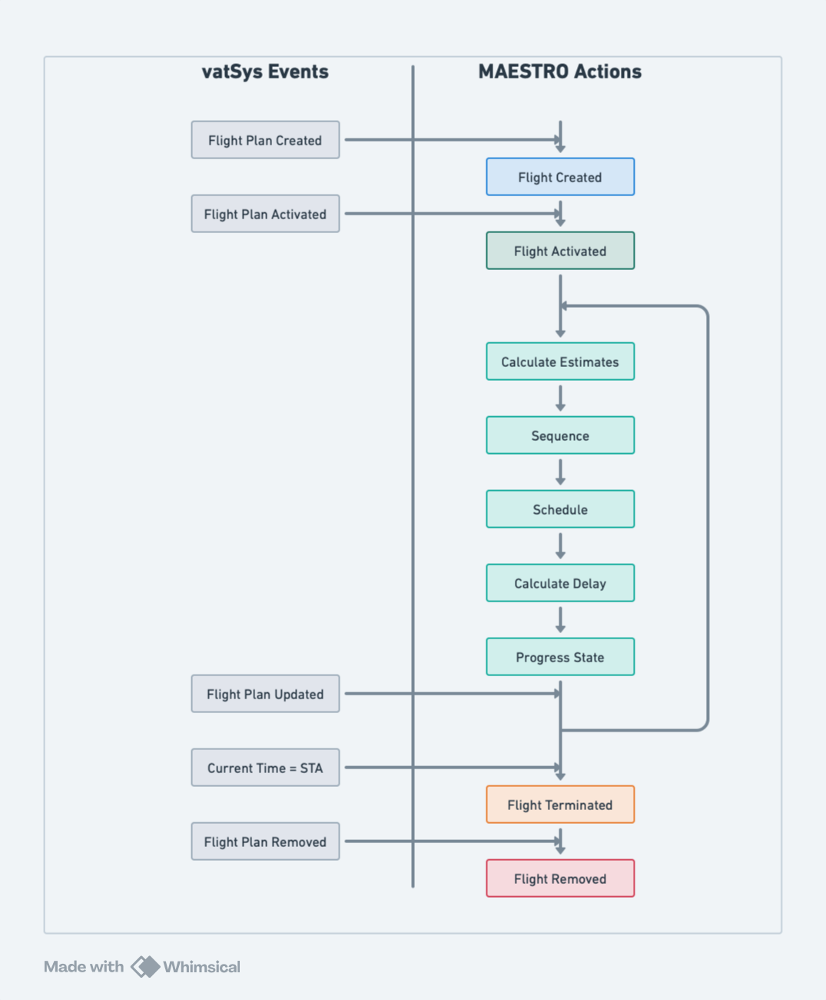
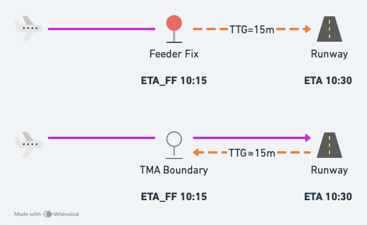
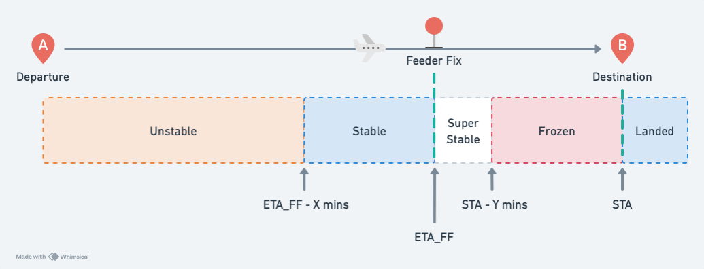

# System Overview

## What is MAESTRO?

MAESTRO is a traffic flow management system that provides sequencing information to controllers to optimise the flow of arrivals into an airport. It sequences inbound arrivals, delaying them when required to achieve a desired landing rate.

MAESTRO is a sequencing aid only. It does not provide separation advice. Controllers remain responsible for ensuring separation is maintained.

## Common Abbreviations

| Term | Meaning |
| ---- | ------- |
| `ETA_FF` | Estimated time at the feeder fix (from vatSys) |
| `ETA` | Estimated landing time (calculated by vMaestro) |
| `STA_FF` | Scheduled time at the feeder fix (calculated by vMaestro) |
| `STA` | Scheduled landing time (calculated by vMaestro) |
| `TTG` | Time-to-Go from feeder fix to runway threshold |

## Managed Airport

The managed airport is the airport vMaestro is sequencing arrivals for. All flights in the sequence are arriving at this airport.

## Departure Airports

Departure airports are airports within close proximity to the managed airport, typically within 30–45 minutes flight time. Flights originating from these airports appear in the [Pending List](#pending-list) when activated.

## Feeder Fixes

A feeder fix is a point along the TMA boundary where flights are transferred from Enroute to the TMA. Feeder fixes generally correspond to a particular STAR, though they may not be the STAR entry point.

vMaestro uses the feeder fix to:

- Determine which runway to assign based on runway mode preferences
- Calculate the landing estimate using predefined trajectories
- Position flights on feeder views

:::info
A flight may have an `ETA_FF` without tracking via a specific feeder fix. In this case, the time represents the expected transfer time to the TMA.
:::

## Terminal Trajectories

Terminal trajectories define the paths a flight takes from its feeder fix to the runway threshold.
vMaestro uses them to estimate arrival times and determine how much delay can be absorbed in each phase of flight.

vMaestro models three terminal trajectories:

- Normal Approach: Used to calculate the travel time from the feeder fix to the runway threshold, or time-to-go (TTG)
- Pressure Approach: A small path extension for absorbing minor delays
- Maximum Pressure Approach: The largest path extension that can be used for absorbing delay within the TMA

## Runway Modes

A runway mode defines which runways are active for arrivals. Each runway mode specifies:

- Which runways are in use
- Landing rates for each runway
- Feeder fix preferences for runway assignment

vMaestro uses the active runway mode to determine how flights are assigned to runways and scheduled.
See [TMA Configuration](02-system-operation.md#tma-configuration) for how to change runway modes during operation.

## Slots

Slots reserve runway capacity by preventing flights from being scheduled during a specific time period.
They are used for special operations, configuration changes, or other reasons requiring a gap in arrivals.

See [Slots](02-system-operation.md#slots) for how to manage slots during operation.

## Flight Creation

When a flight plan is created in vatSys, the flight becomes visible to vMaestro. At this stage, the flight is not yet active and is not being processed.

## Flight Activation

When a flight plan is activated in vatSys, the flight becomes active in vMaestro. Enroute flights within 2 hours of their feeder fix are tracked automatically and added to the sequence.

## Pending List

Flights from departure airports appear in the pending list when their flight plan is activated. These flights must be manually inserted into the sequence.

Pending flights can be inserted prior to departure, allowing any required delay to be absorbed on the ground rather than in the air.

Flights not tracking via a feeder fix also appear in the pending list and must be manually inserted.

## The Processing Cycle

vMaestro processes all active flights every 30 seconds.
Each cycle performs the following steps for each flight.

### 1. Estimate Calculation

The `ETA_FF` is sourced from vatSys route estimates. The landing estimate (`ETA`) is then calculated by adding the time-to-go (`TTG`) from the allocated trajectory.

For flights not tracking via a feeder fix, an average `TTG` will be calculated, and the `ETA_FF` is derived by subtracting the average `TTG` from the last estimate in the flight plan route.

#### Current vs Initial Estimates

vMaestro tracks two sets of estimates for each flight:

- **Current estimates** (`ETA_FF`, `ETA`) — Updated each processing cycle based on the latest data
- **Initial estimates** (`Initial ETA_FF`, `Initial ETA`) — The estimates at the time the flight became Stable

While Unstable, both sets match. Once Stable, the initial estimates are locked and used as the baseline for delay calculations. Recomputing a flight resets the initial estimates to the current values.

### 2. Sequencing

Flights are ordered by their `ETA` following a first-come, first-served approach.

### 3. Scheduling

During scheduling, vMaestro assigns each flight a runway and calculates its scheduled landing time (`STA`). The runway's acceptance rate enforces minimum separation, and conflicts are resolved by delaying flights as necessary.

Runways are assigned based on the active runway mode. If the runway mode specifies preferred feeder fixes, flights via those fixes are assigned to the corresponding runway. Otherwise, vMaestro calculates the `STA` for each available runway and assigns the one resulting in the earliest landing time. Flights not tracking via a feeder fix are assigned to the first runway in the runway mode.

The `STA` is assigned based on the flight's sequence position and is never earlier than the `ETA` unless manually adjusted. The `STA_FF` is then derived by subtracting the trajectory time.

Flights allocated a maximum delay are prioritised. If their calculated delay exceeds the maximum, they are moved forward by swapping with preceding flights until their total delay is within the allocated maximum.

Flights will not be scheduled to land during a Slot, or during a Runway Mode transition period.

:::info
Multiple flights tracking via the same feeder fix may share the same `STA_FF` if they have different trajectory times (e.g., different aircraft categories). Labels may overlap on feeder fix views but will separate on runway views.
:::

### 4. Delay Calculation

The required delay is the difference between the scheduled landing time and the initial estimate. This delay is split into two portions:

- **Enroute delay**: absorbed before the feeder fix through speed reduction, vectoring, or holding
- **Terminal delay**: absorbed within the TMA through speed reduction and vectoring

The terminal trajectory's Pmax determines how much delay can be assigned as terminal delay. Any remainder is assigned to enroute.
If no pressure trajectory is configured, all delay is enroute.

The remaining delay for each portion decreases as the flight absorbs it.
A controller action is calculated based on the total required and remaining delay:

| Controller Action | Meaning |
| ----------------- | ------- |
| Expedite | Delay is negative, and aircraft needs to speed up to meet the required time |
| No Delay | No delay is required |
| Resume | Very small delay remaining, and aircraft will absorb it by resuming track (e.g., completing a turn out of holding) |
| Speed Reduction | Small delay that can be absorbed through speed reduction |
| Path Stretching | Medium delay that requires additional track miles (e.g., vectoring) |
| Holding | Large delay requiring the aircraft to enter a holding pattern |

### 5. State Transition

The flight's state is updated based on time to `ETA_FF` and `STA`. As flights progress through states, processing becomes increasingly restricted. See [Flight States](#flight-states) below.

## Flight States

vMaestro uses states to control how flights are processed. Flights progress through these states as they approach landing.

Estimates are less accurate when flights are far away. As flights get closer, their estimates stabilise, and the need for the sequence to remain stable becomes more important. Flight states balance this by allowing more flexibility early on and progressively locking the sequence as flights approach.

### Unstable

All new flights start in this state. On each update, the full processing cycle runs: estimates are recalculated, the flight is repositioned in the sequence, and scheduling assigns a runway and `STA`. The runway and approach type may change if an earlier `STA` is available on an alternative runway.

### Stable

Flights become Stable as they approach the `ETA_FF`. From this point, only estimates (`ETA_FF`, `ETA`) and remaining delay are recalculated on each update. Sequencing and scheduling no longer run automatically.

Stable flights keep their position unless displaced by controller action on a preceding flight, or a new flight entering with an earlier `ETA`.

:::warning
There is no alert when required delays change. Controllers should regularly review delay figures to recognise changes.
:::

### SuperStable

Flights become SuperStable at their original `ETA_FF`. Processing is the same as Stable, but the flight is fixed in position. All new flights are positioned after it. Displacement only occurs through controller action on this flight or a preceding flight.

### Frozen

Flights become Frozen as they approach the `STA`. Processing is the same as Stable, but the flight cannot be displaced at all, even by controller actions.

### Landed

Flights become Landed at the `STA`. Processing stops entirely. The last 5 landed flights remain visible in case of an overshoot, after which they are removed. Flights are also removed when deleted from vatSys.

## Online Mode

vMaestro supports multi-user operation through an optional server component.
This allows multiple controllers to collaborate on a single sequence in real-time.

### Roles

#### Flow (FMP)

The Flow role is intended for the Flow Management Position. When a controller with the Flow role is online:

- They control the master sequence
- Their client performs all scheduling calculations
- Changes are broadcast to all other connected clients

#### Approach (APP)

The Approach role is intended for Approach controllers working traffic within the TMA.
Depending on configuration, some functions may be restricted.

#### Enroute (ENR)

The Enroute role is intended for Enroute controllers managing traffic prior to the TMA boundary.
Depending on configuration, some functions may be restricted.

#### Observer (OBS)

The Observer role provides read-only access to the sequence.
Observers cannot make any modifications.

### Pseudo-Master Mode

When no controller with the Flow role is online, all connected Approach and Enroute controllers operate in pseudo-master mode (shown as `ENR/FMP` or `APP/FMP`). In this mode:

- All functions are available
- The first connected client becomes the master
- Sequence changes are still synchronised across all clients

### Environments

Environments allow multiple independent sequences for the same airport to run simultaneously on a single server. Common uses include:

- Separating live VATSIM operations from training sessions
- Running multiple training scenarios concurrently

Each environment maintains its own sequence state and does not affect other environments.

### Permissions

Administrators can configure which roles are permitted to perform specific actions. See the [Admin Guide](../admin-guide/02-plugin-configuration.md#server-configuration) for permission configuration details.
