# System Operation

## Starting Maestro

1. Click the `TFMS` button on the vatSys menu bar
2. Select an airport from the menu

:::tip
If the `TFMS` menu item does not appear, refer to the [installation instructions](../admin-guide/01-plugin-installation.md).
:::

## Window Layout

The **upper section** displays the connection status, TMA configuration, runway acceptance rates, upper and lower winds, achieved rates, units, and UTC time.

The **lower section** contains function buttons, view selector buttons, and sequence ladders.

## Function Buttons

| Button | Purpose |
| ------ | ------- |
| `DEPS` | Open the pending departures list |
| `COORD` | Open the coordination window |
| `DESQ` | Open the desequenced flights list (turns white when flights exist) |

## Views

The view buttons switch between different displays of the sequence.
Each view defines one or more ladders filtered by runway or feeder fix, a time reference (`STA` or `STA_FF`), and a label layout.

Views using `STA` are called **Runway views**. Views using `STA_FF` are called **Feeder views**.

## Ladders

Ladders are vertical timelines displaying flights in the sequence. Each tick represents one minute. Flights are positioned based on the view's time reference.

Buttons to the left of the ladders control scrolling:

- **Up/Down Arrows** - Scroll 15 minutes
- **Center Button** - Reset to current time

When scrolled, the time reference at the bottom turns blue. When more than two ladders are present, additional buttons become available for horizontal scrolling.

## Flight Labels

Flight labels are mirrored on each side of the ladder.

Labels may include:

- Aircraft callsign
- Aircraft type code
- Wake turbulence category
- Assigned runway
- Assigned approach type
- Landing Time (STA)
- Feeder Fix Time (STA_FF)
- Total delay assigned
- Remaining delay to be absorbed
- Manual Delay Indicator
- High Speed Indicator (displayed when no delay is required)
- Coupling Status Indicator (displayed when flight plan is not yet linked to a radar track)

The colour of each label item can change based on a configurable colour source:

- Assigned runway
- Assigned approach type
- Feeder Fix
- State
- Runway Mode
- Controller Action

See [Plugin Configuration](../admin-guide/02-plugin-configuration.md#colour-sources) for configuration details.

Right-click a flight label to access actions like changing runway, adjusting delay, or removing the flight. See [Flight Management](#flight-management) for details on each action.

## Connection Status

The Connection Status button (top-left) displays the current connection status.

| Status | Meaning |
| ------ | ------- |
| `OFFLINE` | Not connected to a server. All processing is local and all functions are available. |
| `READY` | Connected to the server but not synchronised. Appears when connected before joining the VATSIM network. |
| `FLOW` | Connected with the Flow role. Processing is done locally and the sequence is shared to all other clients. |
| `APP` | Connected with the Approach role. Some functions may be restricted. |
| `ENR` | Connected with the Enroute role. Some functions may be restricted. |
| `ENR/FLOW` or `APP/FLOW` | Connected with Enroute or Approach role, but no dedicated Flow controller is online. All functions are available. |
| `OBS` | Connected with the Observer role. The sequence is read-only. |

Click the button to open the connection settings and start or stop the connection to the vMaestro server.

## TMA Configuration

The TMA Configuration button displays the current runway mode.

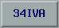

When a configuration change is scheduled for the future, the button text turns white and shows:
`[Current Configuration] → [New Configuration] at [Change Time]`

### Changing the Configuration

Click the TMA Configuration button to open the TMA Configuration window.

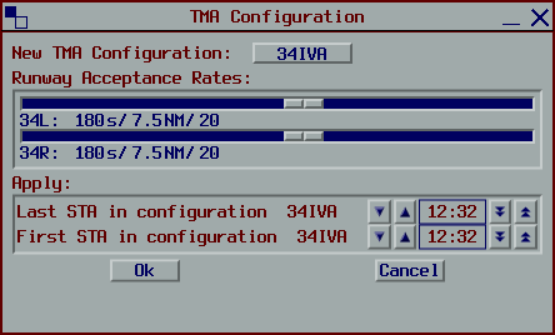

From this window you can:

- Select a predefined runway mode
- Adjust acceptance rates for each runway using the sliders
- Schedule when the configuration change takes effect

#### Scheduling Configuration Changes

The validity period is controlled by two times:

- **Last STA in configuration** - The last landing time using the current configuration
- **First STA in configuration** - The first landing time using the new configuration

Use the arrow buttons to adjust these times:

- Single arrows change by 1 minute
- Double arrows change by 5 minutes

:::info
Flights scheduled to land after the "First STA in configuration" time will be processed using the new configuration.
:::

:::info
When a gap exists between the two times, no flights may land during that period.
Any flight with an estimate within this gap will be delayed until after the new configuration begins.
:::

### Runway Acceptance Rates

The Runway Acceptance Rates button displays each active runway with its current acceptance rate.

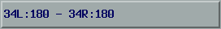

The acceptance rate is the minimum time separation between successive landings on that runway.

## Wind Configuration

The Winds button displays the current surface and upper winds.

Surface winds are sourced from METAR, while upper winds are sourced from GRIB. Winds are automatically updated every 30 minutes.

Surface winds are used to calculate the average distance between arrivals on the runway. Upper winds are used to augment TMA trajectory calculations.

When manually overridden, the button text turns white.

:::info
The Winds button is only visible to Flow and Approach controllers, and to Enroute controllers when acting as pseudo-flow (when no Flow controller is online).
:::

### Changing the Winds

Click the Winds button to open the Wind Configuration window.

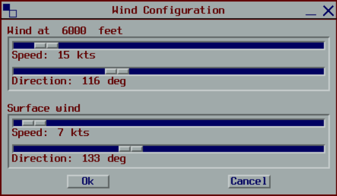

From this window you can:

- View and modify the upper wind speed and direction
- View and modify the surface wind speed and direction

Manual wind overrides will be used until the next automatic update, which will overwrite any manual changes.

## Achieved Rates

The Achieved Rates section displays the actual landing rate for each active runway compared to the desired acceptance rate. The rate is shown in the currently selected unit (see [Units Selector](#units-selector)).

For each runway, the section shows:
- The achieved landing rate
- The deviation from the desired rate

If the deviation is not significant, `NS` (Not Significant) is displayed.

When a numeric deviation is shown:
- **Positive numbers** indicate the runway is handling more landings than desired (higher throughput)
- **Negative numbers** indicate the runway is handling fewer landings than desired (lower throughput)

:::info
The Achieved Rates section is only visible to Flow and Approach controllers, and to Enroute controllers when acting as pseudo-flow (when no Flow controller is online).
:::

## Units Selector

The Units Selector button cycles through different units for displaying landing rates. Click the button to switch between available units:

- `S`: Seconds between arrivals
- `NM`: Distance between arrivals in nautical miles
- `Ac`: Aircraft per hour

The selected unit affects how runway acceptance rates and achieved rates are displayed throughout the interface.

:::info
The Units Selector is only visible to Flow and Approach controllers, and to Enroute controllers when acting as pseudo-flow (when no Flow controller is online).
:::

## Flight Management

### Inserting Flights

#### Departures

Flights from departure airports must be manually inserted into the sequence.

1. Click the `DEPS` button
2. Select the flight from the Pending list
3. Set the expected take-off time
4. Click `OK`

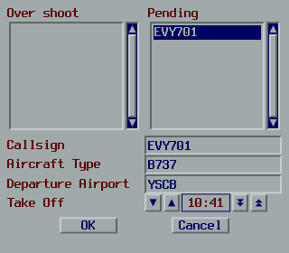

The landing estimate is calculated from the take-off time plus a predefined flight time. The coupling status indicator may appear until the flight departs and couples to a radar track.

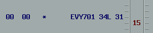

:::tip
If Maestro calculates delay before departure, this can be absorbed on the ground.
:::

#### Overshoot Flights

To resequence a flight that has conducted a missed approach:

1. Right-click on another flight (or the ladder in a runway view)
2. Select `Insert Flight`, then `Before` or `After`
3. Select the overshoot flight from the list
4. Click `OK`

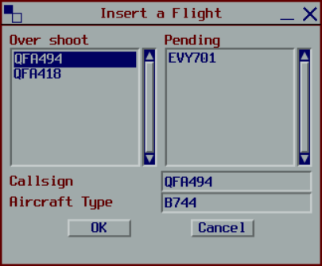

**Before** inserts the flight ahead of the target, delaying the target flight. **After** inserts behind the target without affecting it.

:::info
Flights cannot be inserted between two Frozen flights when the gap is less than twice the acceptance rate.
:::

#### Dummy Flights

Dummy flights are placeholders for flights not tracked by vatSys (airwork, practice approaches, etc.).

1. Right-click on another flight (or the ladder in a runway view)
2. Select `Insert Flight`, then `Before` or `After`
3. Enter the flight details (or leave blank for an auto-generated callsign)
4. Click `OK`

### Moving Flights

Flights can be moved within the sequence from a runway view.

1. Left-click a flight label to select it (a frame appears)
2. Left-click the destination position on the ladder

Alternatively, drag the flight label up or down the ladder.

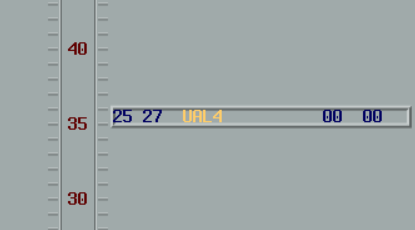

To deselect without moving, left-click the flight again or right-click anywhere.

To swap two flights, select one flight then click another. The two flights exchange positions.

:::info
Flights cannot be moved between two Frozen flights when the gap is less than twice the acceptance rate.
:::

### Modifying Flights

#### Change Runway

1. Right-click the flight
2. Select `Change Runway`
3. Select the new runway

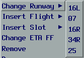

The flight is reinserted into the sequence based on its estimate for the new runway.

#### Change Approach Type

1. Right-click the flight
2. Select `Change Approach Type`
3. Select the approach type

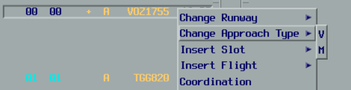

The landing estimate is recalculated. The sequence position remains unchanged.

#### Change ETA_FF

If the vatSys estimate is inaccurate, it can be manually overridden.

1. Right-click the flight
2. Select `Change ETA_FF`
3. Set the new time
4. Click `OK`

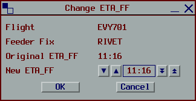

The flight is reinserted based on the new estimate. Future updates from vatSys are ignored until the override is cleared.

#### Manual Delay

To limit the maximum delay a flight can receive:

1. Right-click the flight
2. Select `Manual Delay`
3. Select the maximum delay

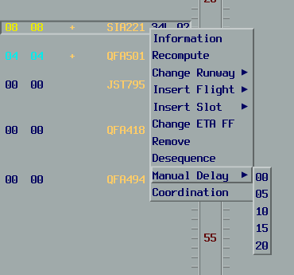

The flight is repositioned to not exceed the specified delay. New flights entering the sequence will not push this flight beyond its delay limit.

:::info
A delay of `00` still allows delay up to the runway's acceptance rate.
:::

#### Recompute

Recomputing resets a flight to its original state, clearing any manual overrides.

1. Right-click the flight
2. Select `Recompute`

This clears any manual delay or ETA_FF override, recalculates the estimates, and reinserts the flight as if it were new.

### Removing Flights

#### Desequence

Desequencing temporarily removes a flight from the sequence for holding, technical issues, or other reasons. The flight can be quickly resequenced later.

1. Right-click the flight
2. Select `Desequence`

The flight moves to the Desequenced list.

To resequence:

1. Click the `DESQ` button
2. Select the flight
3. Click `RESEQUENCE`

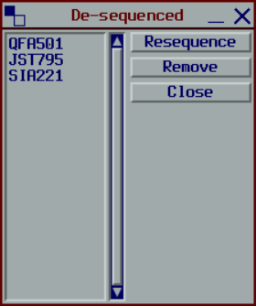

#### Make Pending

For departures that have not yet taken off:

1. Right-click the flight
2. Select `Make Pending`

The flight returns to the Pending list and can be reinserted later.

#### Remove

Removing deletes a flight from the sequence (for diversions, cancellations, etc.).

1. Right-click the flight
2. Select `Remove`
3. Click `Confirm`

The flight moves to the Pending list and can be reinserted if needed.

### Viewing Flight Information

To view detailed information about a flight:

1. Right-click the flight
2. Click `Information`

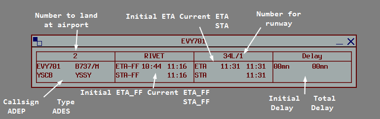

Up to 4 Information windows can be displayed simultaneously.

## Slots

Slots reserve runway capacity by preventing flights from being scheduled during a specific time period. For more on how slots affect scheduling, see [System Overview](./01-system-overview.md#slots).

### Creating a Slot

1. Right-click on the ladder in a runway view
2. Select `Insert Slot`
3. Adjust the start and end times
4. Click `OK`

The slot appears on the ladder. Any non-frozen flights within the slot are delayed until after the slot ends.

### Modifying a Slot

1. Left-click the slot on the ladder
2. Adjust the start and end times
3. Click `OK`

### Removing a Slot

1. Left-click the slot on the ladder
2. Click `Remove`

## Coordination

Maestro supports sending predefined coordination messages to other controllers connected to the same server.

### General Coordination

1. Click the `COORD` button
2. Select a message from the list
3. Click `DESTINATION`
4. Select the recipient from the dropdown

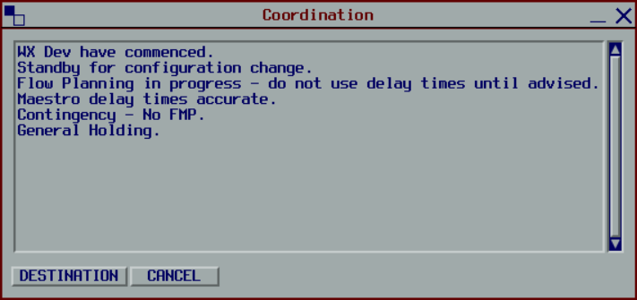

### Flight Coordination

1. Right-click on a flight label
2. Select `Coordination`
3. Select a message from the list
4. Click `SEND`

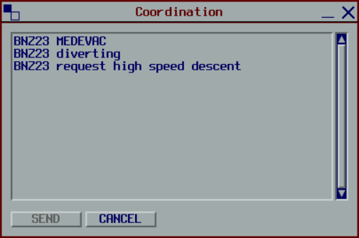

Flight coordination messages include the flight's callsign and are sent to all relevant units.

### Receiving Messages

Incoming coordination messages appear in the Information window.

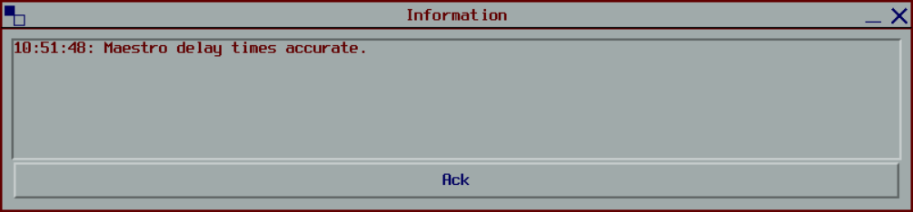

Click `ACK` to acknowledge and clear the messages.
