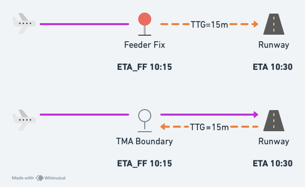
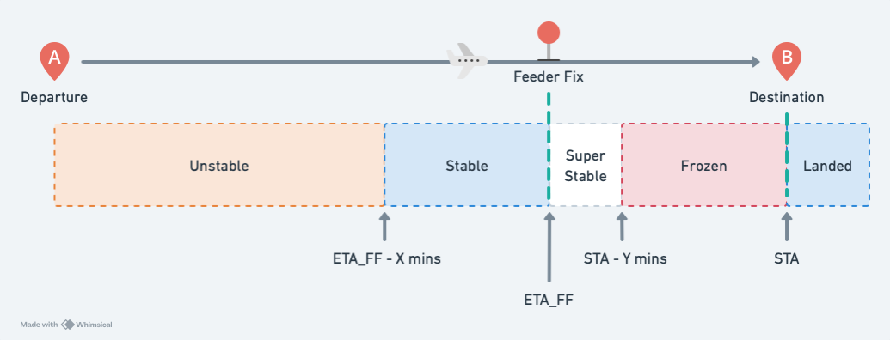

# System Overview

<!-- TODO: Claude, please fill this in. -->

## Terminology and Abbreviations

| Term | Meaning |
| ---- | ------- |
| Feeder Fix (FF) | A point on the TMA boundary. |
| `ETA` | Estimated time of arrival **at the runway**. |
| `STA` | **Scheduled** time of arrival at the runway (landing time) calculated by Maestro. |
| `ETA_FF` | Estimated time of arrival at the **feeder fix**. |
| `STA_FF` | **Scheduled** time of arrival at the feeder fix calculated by Maestro. |
| Managed Airport | The airport Maestro is sequencing arrivals for. |
| Departure Airport | An airport typically within 30 minutes flight time of the managed airport. |
| Close Airport | An airport within close proximity to the managed airport. |

## Flight Thread

Flights are tracked by Maestro when:

- within 2 hours flight time of the feeder fix
- an FDR is activated for a flight from a departure airport or a close airport

Once a flight is tracked by Maestro, vatSys will provide Maestro with updated position information and estimates every 30 seconds.

At each update, the estimates are re-calculated.
The flights position in the sequence, `STA_FF`, and `STA` may be re-calculated depending on its [State](#flight-states).

When the flight has reached its `STA`, it will no longer be processed by Maestro, but it will remain available for a short period of time in case of an overshoot.

<!-- ## Wind

Maestro will consider wind when calculating the TMA trajectory times.

There are two wind inputs:

- The surface wind, updated automatically.
- A 6,000 ft wind provided by the GRIB.

Wind can be manually entered, but the next automatic update will override it. -->

## Estimate Calculation

The Feeder Fix estimate (`ETA_FF`) is sourced from the vatSys route estimates (These are often referred to as "system estimates").

Maestro uses the `ETA_FF`, plus a pre-defined `ETI` (estimated time interval) to calculate the landing estimate (`ETA`).

The arrival `ETI` is defined per-feeder fix, approach type, aircraft type, and runway (see [Arrival Configuration](./../configuration-guide/index.md#arrivals)).

:::info
Once a flight has passed the feeder fix, the `ATO` (actual time over) is used to calculate the landing estimate.
The `ATO` cannot change, so the `ETA` and remaining delay values **will not change** once a flight has passed the feeder fix.
:::

## `STA` and `STA_FF` calculation

Landing time (`STA`) is calculated initially based on the landing estimate (`ETA`).
Once the estimate has been calculated, Maestro will check if the preceeding flight is within the acceptance rate of the current TMA configuration.
If the time between the two flights is less than the acceptance rate, the later flight is delayed to achieve the desired acceptance rate.
The `STA` will never be earlier than the `ETA` unless a flight is moved by controller input.

Once the `STA` has been calculated, the arrival `ETI` is subtracted from the `STA` to determine the `STA_FF`.

:::info
It's possible for multiple flights tracking via the same feeder fix to share the same `STA_FF`.
This can occur when the arrival `ETI` for the two flights differs (i.e. different aircraft caterogies), resulting in different landing times.

When this happens, the enroute ladders will display the two flight labels on top of each other.
The labels will be separated on the runway ladders.
:::

## Flight States

Maestro uses various "States" for flights that affect how they are processed.

### Unstable

After each update from vatSys, unstable flights are re-positioned in the sequence based on their calculated `ETA`, and their `STA_FF` and `STA` times are re-calculated.

All new flights will remain unstable for at least 5 minutes before they progress into one of the following states.

### Stable

Flights become stable 25 minutes prior to the `ETA_FF`.

Stable flights will keep their position in the sequence unless a flight appears, disappears, or moves before it.

Stable flights can be displaced by:

- a preceeding flight being moved by controller action
- a new flight entering the sequence with an earlier `ETA_FF`

The required delay figures will change when the flight moves.

:::info
There is no message or other indication to alert controllers of changes to required delays.
Controllers may need to regularly review the Maestro delay figure to recognise changes.
:::

### Super Stable

Flights become super stable at the original `ETA_FF`.

Super stable flights are "fixed" in position.
All new flights are positioned after super stable flights.

Super stable flights can be moved manually by controller interaction.

### Frozen

Flights become frozen within 15 minutes of the `STA`.

No changes can be made to Frozen flights.

### Landed

Flights become landed at the `STA`.

No changes can be made to Landed flights.

The last 5 landed flights remain in the system in case of an overshoot.

## Pending List

The Pending list contains flights that cannot be automatically inserted into the sequence, and must be inserted manually.

Flights from departure airports, or flights not tracking via a feeder fix are automatically inserted into the pending list when their FDR is activated.

Flights from a departure airport can be inserted prior to departure to allow the pilot to absorb any required delay on the ground if possible.

<!-- Flights from airports within the TMA must be manually inserted into the sequence. -->

## Slots

Slots are periods of time where no flights can be scheduled to land on the concerned runway.

Maestro will not schedule flights to land within a slot, but may schedule them to land at the beginning or end of a slot.

`Frozen` flights are the only flights allowed to land during a slot.
