# System Operation

<!-- TODO: Re-structure based on Claudes suggestions. Remove UI-reference stuff. -->
<!-- Separate sections for Workflows and UI reference. -->

## Starting Maestro

Maestro can be started by clicking the `TFMS` button on the vatSys menu bar, then clicking `New TFMS Window`.

A `Maestro Setup` window will appear. Select the desired airport, then click `Start`.

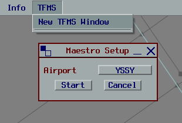

This will open a blank Maestro window.

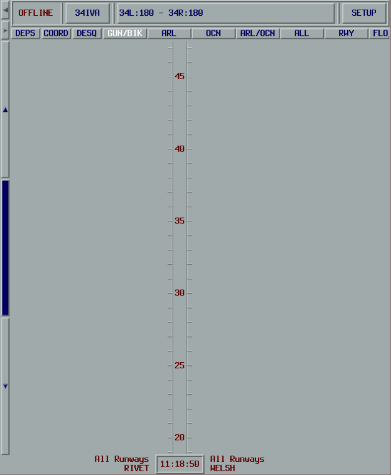

:::tip
If you do not see the `TFMS` menu item, refer to the [installation instructions](./01-installation.md).
:::

## User Interface

The Maestro window is divided into two sections.

The **Configuration Zone** provides access to:

- Online status (see [Online Operation](./04-online-operation.md))
- TMA configuration
- Runways in use and relevant acceptance rates
- Online setup
<!-- - Wind speed and direction (6,000 ft and surface level winds) -->
<!-- - Achieved landing rates -->
<!-- - Units selector -->
<!-- - UTC time -->

The **Sequence Display Zone** provides access to:

- Buttons for interacting with the sequence
- View selection buttons
- Sequence timelines

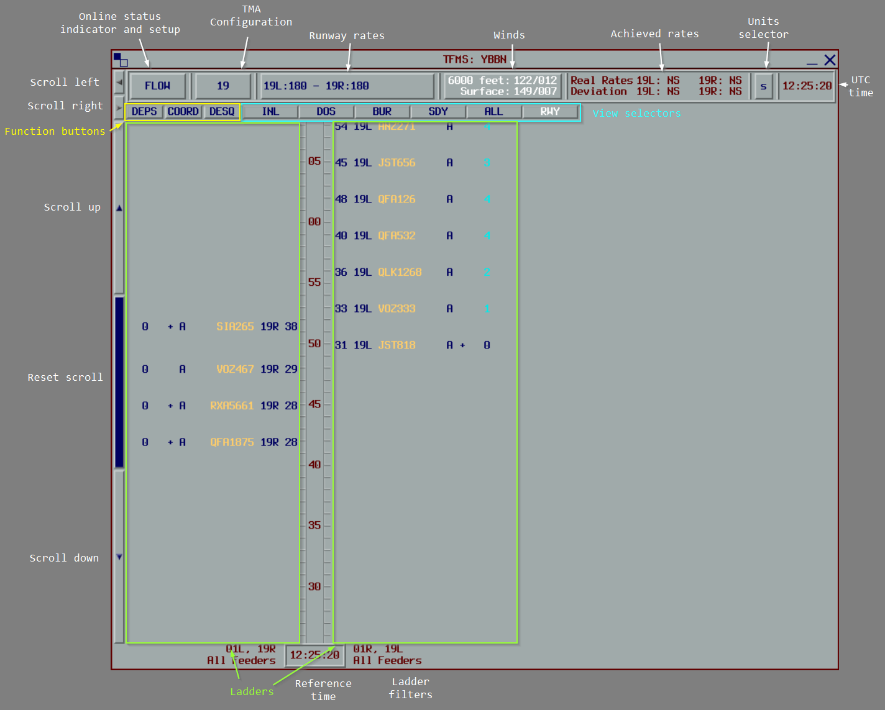

### Configuration Zone

#### Online Status Indicator

The Online Status Indicator displays the status of the connection to the Maestro server.

<!-- Move to online-operation -->

| Status | Meaning |
| ------ | ------- |
| `OFFLINE` | **The sequence is not synchronised with other clients.** All processing is done locally, and all functions are available. |
| `READY` | A connection to the Maestro server has been established, but no data is synchronised. This will appear when connecting to the server before connecting to the VATSIM network. |
| `FMP` | Connected to the server with the `Flow` role. All processing is done locally and the sequence is shared to all other connected clients. |
| `APP` | Connected to the server with the `Approach` role. Access to certain functions may be restricted. |
| `ENR` | Connected to the server with the `Enroute` role. Access to certain functions may be restricted. |
| `ENR/FMP` or `APP/FMP` | Connected to the server with the `Enroute` or `Approach` role, but there is no dedicated `FMP` controller online. All functions are available. |
| `OBS` | Connected to the server with the `Observer` role. The sequence is read-only, and all modifications are disallowed. |

#### TMA Configuration

The TMA Configuration button will display the currently selected TMA configuration.

Clicking on the TMA Configuration button opens the TMA Configuration window.

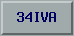

When a configuration change is scheduled to occur in the future, the text of the button will turn white, and the button will read `[Current Configuration] → [New Configuration]`.

#### Runway Acceptance Rates

The Landing Rates button displays each active runway along with the specified acceptance rates.

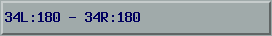

<!-- #### Winds -->

<!-- #### Achieved Landing Rates -->

<!-- #### Units Selector -->

#### Online Setup

The `SETUP` button opens the `Online Setup` window, where connection details can be provided for connecting to the Maestro server.

### Sequence Display Zone

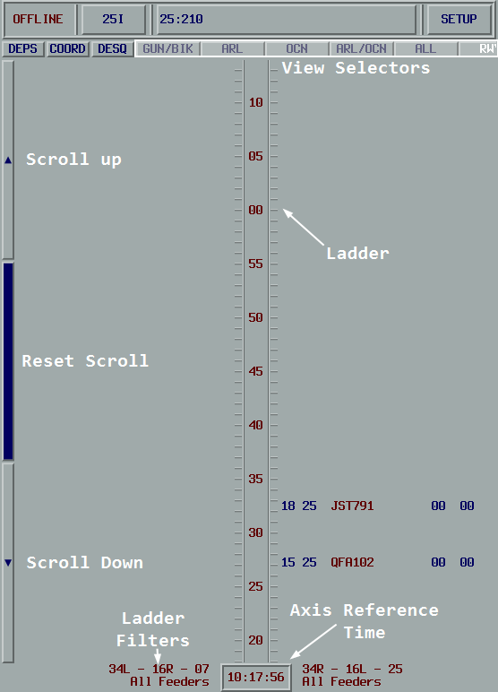

The top of the Sequence Display Zone contains various buttons with the following purposes:

| Button | Purpose |
| ------ | ------- |
| `DEPS` | Opens the `Insert a Flight` window, allowing pending flights from departure airports to be manually inserted into the sequence. |
| `COORD` | Opens the `Coordination` window for sending pre-defined messages to other controllers. |
| `DESQ` | Opens the `Desequenced` window, showing a list of flights that have been de-sequenced. The text of this button will become white when at least one flight exists in the list. |
| View Selectors | The remaining buttons correspond to pre-defined views that control what is displayed in the lower part of the Sequence Display Zone. |

The lower part of the Sequence Display Zone contains one or more timelines as defined by the selected view.

#### Timelines

Each view contains two timelines.

Each tick on the ladder corresponds to one minute.

There are three buttons to the left of the timelines allowing the timelines to be scrolled up or down in 15-minute increments.
The center button will reset to the current time. If the timelines are scrolled, the axis reference time at the bottom <!-- (or top) --> of the timeline will turn blue.

#### Flight Labels

Flights are displayed on the timeline using their `STA` (runway view) or the `STA_FF` (feeder view) depending on the selected view.

In this example, the selected view is a runway view, so the `STA` is `28` with an `ETA_FF` of `15`.

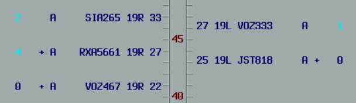

Flight labels are mirrored on each side of the ladder.

Reading from innermost to outermost, the flight label contains:
1. `STA` (in feeder view) or `STA_FF` (in runway view)
2. Assigned runway
3. Callsign
4. `#` if zero delay has been assigned
5. `%` if manual delay (other than zero) has been assigned
6. `+` if the flight must cross the feeder-fix at published speed
7. `*` if the FDR is not coupled to a radar track
8. Total delay required (based on the initial `ETA`)
9. Delay remaining (based on the current `ETA`)

Note the two separate delay values. The total delay required is the total delay Maestro has assigned to the flight. As the flight absorbs the delay (i.e. speed reduction, vectors, or holding), this value will remain unchanged.
The remaining delay will progressively reduce as the flight absorbs the total delay required. When the remaining delay reads `00`, all required delay has been absorbed.

In the below example, QFA501 has been assigned a 2-minute delay. They have absorbed one minute of the delay, and need to lose one more minute.

Right-clicking on a flight label will open a context menu with the following options:

| Context Menu Item | Description |
| ----------------- | ----------- |
| Change Runway | Change the runway assigned to this flight. |
| Change Approach Type | Changes the approach type assigned to this flight. |
| Insert Slot | Insert a slot before or after this flight. |
| Insert Flight | Insert a new flight before or after this flight. |
| Coordination | Send a flight-specific coordination message for this flight. |
| Change ETA_FF | Manually adjust the `ETA_FF` |
| Information | Displays detailed sequencing information related to this flight. |
| Manual Delay | Assign a manual delay to this flight. |
| Remove | Remove the flight from the sequence. |
| Recompute | Re-compute the flight's position and landing time as if it were a new flight. |
| Desequence | Move the flight to the De-sequenced list, removing it from the sequence. |
| Make Pending | If this flight is departing from a departure airport, and has not yet departed, places them back into the pending list and removes them from the sequence. |

<!-- #### View Configuration

Each view can be configured as follows:

- Time horizon: The duration of the sequence displayed on the screen.
- Number of timelines: Up to 4 timelines can be displayed.
- Timeline direction: Timelines may move up or down the screen.
- Timeline reference: Flights can be displayed based on their `STA` (Runway view) or their `STA_FF` (Feeder view).
- Runway and Feeder Fix filters: Each timeline can be filtered to display flights depending on their assigned runway or Feeder Fix.

The content of flight labels can also be configured to display the following information:

- Callsign
- Aircraft type
- Aircraft weight class
- Allocated runway
- Approach type
- `STA`
- `STA_FF`
- Total delay (The total amount of delay the flight needs to absorb to land at the calculated `STA`)
- Current delay (The delay yet to be absorbed)
- Coupling status indicator
- Manual delay indicator
- Control action indicator

Each of the flight label fields can be color coded depending on:

- Destination
- Allocated runway
- Approach type
- Feeder Fix
- Maestro State
- Runway configuration (i.e. whether the flight has been processed with the current or future runway configuration) -->

## Modifying the TMA Configuration

To change the TMA Configuration, click the TMA Configuration button in the Configuration Zone. This will open the `TMA Configuration` window.
Here, a pre-defined TMA configuration can be selected, or the current configuration can be modified.
Runway acceptance rates can be changed by adjusting the sliders for each runway.

The validity period of the configuration can be adjusted using the `Last STA in configuration ...` and `First STA in configuration ...` times.
The single-arrow buttons change the time in 1-minute increments, and the two-arrow buttons in 5-minute increments.

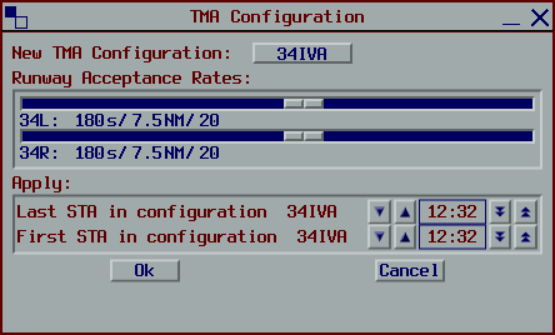

:::info
Flights scheduled to land after the `First STA in configuration ...` time will be processed using the new configuration.
:::

:::info
When a gap exists between the `Last STA ...` and `First STA ...` times, no flights may land during that period of time. Any flight with an estimate within this gap will be delayed until after the `First STA ...` time.
:::

<!-- ### Change Acceptance Rates -->

<!-- To change the acceptance rates, click the Runway Acceptance Rates button in the Configuration Zone. This will open the `Runway Acceptance Rates` window.
Here, the acceptance rates can be changed by adjusting the sliders for each runway.

The validity period of the rates change can be adjusted using the `Change rates at` time.
The single-arrow buttons change the time in 1 minute increments, and the two-arrow buttons in 5 minute increments.

Flights scheduled to land after the `Change rates at` time will be processed using the new acceptance rates. -->

<!-- TODO: Runway Acceptance Rates Window Screenshot -->

<!-- ## Change displayed units -->

## Inserting Flights

### Inserting a flight from a departure airport

Flights from departure airports must be manually inserted into the sequence.

To insert a departure, click the `DEPS` button in the Sequence Display Zone, and the `Insert a Flight` window will appear. Select the flight from the `Pending` list, and set the `Take Off` time to its expected take-off time. 

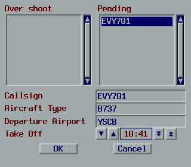

Click `OK` to insert the flight into the sequence. The `ETA` will be calculated based on the provided take-off time plus the `EET` in the flight plan. The flight will be displayed on the ladder and immediately become `Stable`. Note that the `*` symbol may appear on the label to indicate that the flight is not coupled.

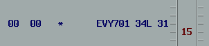

Uncoupled flights will not update the `ETA_FF` automatically.
Once the flight has departed and become coupled, the `ETA_FF` along with any required delays will be updated.

:::tip
If Maestro calculates a delay prior to departure, this can be absorbed on the ground.
:::

### Inserting overshoot flights

Overshoot flights are flights that have conducted a missed approach or a go-around, and need to be re-inserted into the sequence at a later point in time.

To insert an overshoot flight, right-click on another flight (or on the ladder if a runway view is selected), then select the `Insert Flight > Before/After` option. This will open the `Insert a Flight` window.

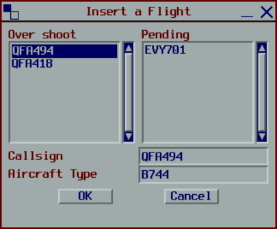

Select the desired flight, then press `OK` to insert the flight. The overshoot flight will immediately become `Frozen`.

:::info
Flights cannot be inserted between two `Frozen` flights when the time between them is less than twice the acceptance rate.
:::

### Inserting dummy flights

Dummy flights are placeholders not coupled to a real flight tracked by vatSys.
They can be used to represent flights conducting airwork, practice approaches, etc.

To insert a dummy flight, right-click on another flight (or on the ladder if a runway view is selected), then select the `Insert Flight > Before/After` option. This will open the `Insert a Flight` window.

Enter the details of the flight, then press `OK` to insert the flight. The dummy flight will immediately become `Frozen`. If the details are omitted, the callsign will default to `****xx*` where `xx` is a two-digit number.

:::info
Flights cannot be inserted between two `Frozen` flights when the time between them is less than twice the acceptance rate.
:::

### Relative Flight Insertion

The `Before` and `After` options can be used to insert the flight before or after another flight.
The `Before` option will cause the inserted flight to **take the place** of the target flight, resulting in the target flight receiving an additional delay. This is not available on `Frozen` flights.

The `After` option places the inserted flight behind the target flight, and does not affect the target flight.

## Modifying Flights

### Change Runway

To override the runway assigned by Maestro, right-click the flight, select `Change Runway`, then select the new runway.

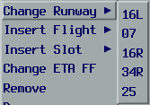

When the new runway is assigned:
- the flight is re-inserted into the sequence based on its `ETA`
- if the flight was `Unstable`, it becomes `Stable`
- the rest of the sequence is re-calculated

<!-- ### Change Approach Type -->

### Change `ETA_FF`

If the `ETA_FF` derived from vatSys is inaccurate, it can be manually overridden using the `Change ETA_FF` function.

Right-click the flight, and select `Change ETA_FF`. This will open the `Change ETA_FF` window.

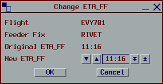

Select the desired time, then press `OK`.

When a manual `ETA_FF` has been specified:
- the `ETA` is recalculated
- the flight is re-inserted into the sequence based on the new `ETA`
- if the flight was `Unstable`, it becomes `Stable`
- the rest of the sequence is re-calculated
- any updates to the `ETA_FF` from vatSys will be ignored

The manual `ETA_FF` can be cancelled using the [Recompute](#recompute) function.

### View Flight Information

Detailed information about a flight in the sequence can be accessed by right-clicking a flight, then clicking `Information`.
This will display the `Information` window.

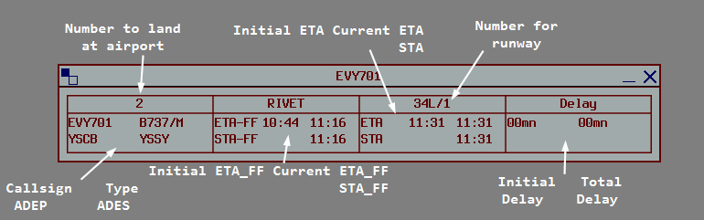

Up to 4 `Information` windows can be displayed at once.

### Increase Priority (Manual Delay)

The priority of a flight can be increased using the `Manual Delay` function.
This will ensure the flight receives **no more** than the specified delay.

Right-click the flight, then select `Manual Delay`.
A drop-down will appear with various delay values.

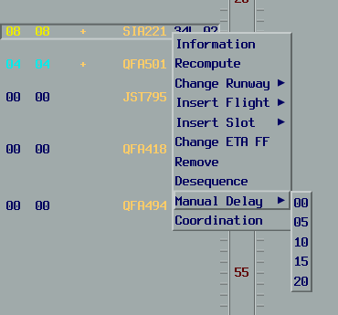

When a manual delay is specified:
- the flight is positioned in the sequence such that the specified delay is not exceeded
- the rest of the sequence is re-calculated
- new flights entering the sequence ahead of this one will not cause a delay in excess of the specified delay

Manual delay can be cancelled using the [Recompute](#recompute) function.

:::info
If a delay of `00` is specified, the flight can still be delayed up to the runway's acceptance rate.
:::

### Moving Flights

Flights can be moved throughout the sequence from a runway view.

Left-click a flight label to select it, a frame will be displayed around the selected flight.
The flight can be de-selected by left-clicking it again.

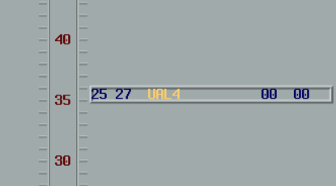

Left-click on the timeline where the flight should be moved to.
A confirmation will appear. Click `Confirm` to move the flight.

When a flight is moved:
- the `STA` is set to the time corresponding to where the second left-click occurred
- if another timeline was clicked, the flight will be re-assigned to the runway corresponding to that timeline
- if the flight was `Unstable`, it becomes `Stable`
- the rest of the sequence is re-calculated

If a second flight is clicked, the `STA` and runways of the two flights are swapped.

:::info
Flights cannot be moved between two `Frozen` flights when the time between them is less than twice the acceptance rate.
:::

Alternatively, flights can be dragged up and down the ladder by left-clicking the flight and holding the mouse button down while moving the mouse cursor.
When the button is released, a confirmation window will appear as before.
Clicking `Confirm` will move the flight to the specified time.

### Recomputing

Re-computing a flight will re-calculate the flight's parameters as if it were a new flight.

Re-computing a flight will:
- remove it from the sequence
- cancel any manual delay and manual ETA_FF
- re-calculate the feeder fix (in case of a re-route), its estimate, and the landing estimate
- insert the flight based on the new estimates
- re-calculate the rest of the sequence

### Removing Flights

Flights can be removed from the sequence in a few different ways.

#### De-sequence

De-sequencing a flight places it into the De-sequenced list, temporarily removing it from the sequence (i.e. holding for operational reasons, technical issues, etc.)
De-sequenced flights can quickly be re-inserted at a later time from the De-sequenced list (see [Re-Sequence a De-sequenced Flight](#re-sequence-a-de-sequenced-flight)).

To de-sequence a flight, right-click the flight, then select `Desequence`.
The flight will be placed into the De-sequenced list, and the rest of the sequence is re-calculated.

#### Make Pending

Flights from departure airports can be removed from the sequence using the `Make Pending` function.
This can only be done before the flight departs.

To remove a departure, right-click the flight, then select `Make Pending`.
The flight will be removed from the sequence and placed into the Pending list. The rest of the sequence will be re-calculated.

The flight can be inserted again using the [Insert a Flight](#inserting-a-flight-from-a-departure-airport) function.

#### Remove

Removing a flight will delete it from the sequence (i.e. in the event of a diversion).
The flight may be re-inserted at a later time using the [Insert a Flight](#inserting-flights) function.

To remove a flight, right-click the flight, then select `Remove`.
A confirmation will appear. Click `Confirm` to remove the flight.

When a flight is removed, the rest of the sequence is re-calculated, and the removed flight is placed into the pending list.

:::tip
De-sequenced flights can also be removed from the De-sequenced list by clicking on the `DESQ` button in the Sequence Display Zone, selecting the flight, then clicking `REMOVE`.
:::

## Re-Sequence a De-sequenced Flight

To re-insert a de-sequenced flight, click the `DESQ` button in the Sequence Display Zone to open the `Desequenced Window`.
Select the flight to re-sequence, then click `RESEQUENCE`.

When a flight is re-sequenced:
- it is placed in the sequence at a position based on its last `ETA_FF` received from vatSys
- it immediately becomes `Stable`
- the rest of the sequence is re-calculated

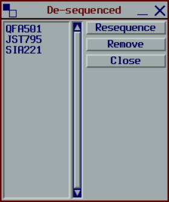

## Slots

Slots can be inserted and removed from the sequence from the runway view.

To insert a slot, right-click the timeline, then select `Insert Slot`.
This will display the `Insert Slot Window`.

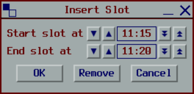

Adjust the start and end times as necessary, then click `OK` to insert the slot.

The slot will be displayed on the timeline based on the runway filters for that timeline.

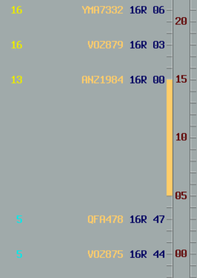

The slot can be adjusted by left-clicking on the slot on the timeline to open the `Insert Slot Window` again.
The start and end times can be adjusted as required.
Pressing `OK` will update the start and end times of the slot.
Pressing the `Remove` button removes the slot from the sequence.

When a slot is created (or changed):
- any non-frozen flights within the slot are delayed until after the slot has ended
- the rest of the sequence after the slot ends is re-calculated

## Coordination

Coordination messages can be sent by clicking the `COORD` button in the Sequence Display Zone.
This will open the `Coordination` window with a list of general coordination messages.

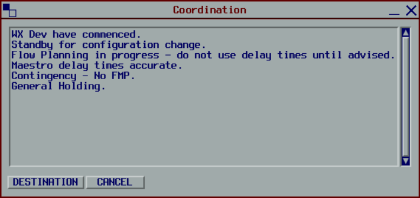

Select one of the messages, then left-click the `DESTINATION` button.
This will present a dropdown of other controllers connected to the Maestro server.
Left-clicking one of the dropdown menu items will send the coordination message to that controller.

Coordination messages are displayed in the `Information` window.

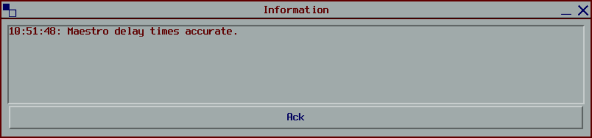

Left-click the `ACK` button to close the window and clear the messages.
Once messages have been `ACK`-ed, they cannot be restored.

### Flight-Specific Coordination

Coordination can also be initiated from the flight label by right-clicking the flight, then selecting `Coordination`.

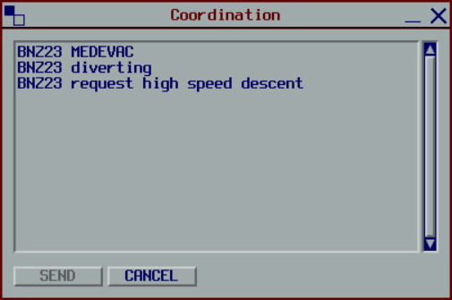

Select one of the messages, then left-click the `SEND` button.
This will send the coordination message to all relevant units.
