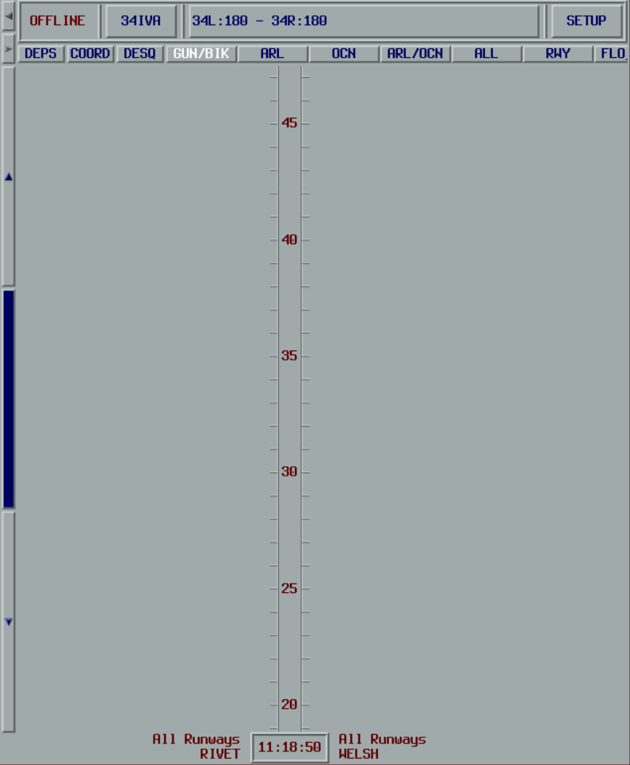
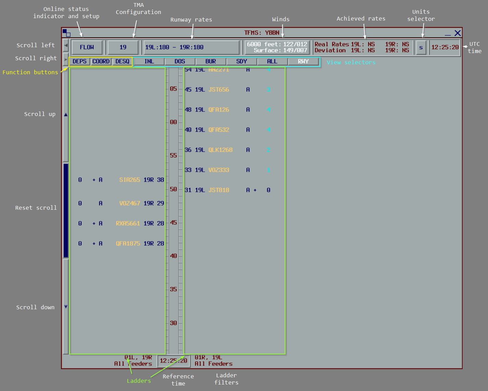
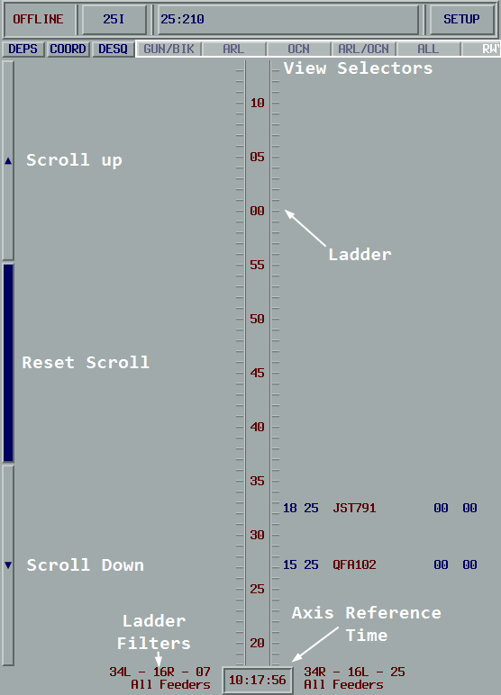
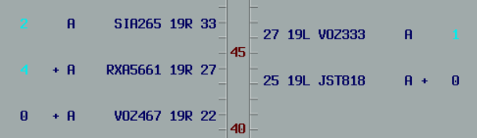
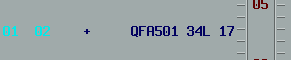

# Interface

This page describes the vMaestro user interface and how to navigate it.

## Starting vMaestro

1. Click the `TFMS` button on the vatSys menu bar
2. Select an airport from the menu

This opens a blank vMaestro window.

:::tip
If the `TFMS` menu item does not appear, refer to the [installation instructions](../../admin-guide/01-plugin-installation.md).
:::

## Window Layout

The vMaestro window is divided into two main sections:

### Configuration Zone

The upper section provides access to:

- **Online Status** - Connection state indicator (see [Online Mode](../system-overview/04-online-mode.md))
- **TMA Configuration** - Current runway mode selection
- **Runway Acceptance Rates** - Active runways and their landing rates
- **Online Setup** - Server connection settings

### Sequence Display Zone

The lower section provides access to:

- **Action Buttons** - Controls for sequence operations
- **View Selectors** - Buttons to switch between different views
- **Timelines** - Visual display of the sequence

## Action Buttons

| Button | Purpose |
| ------ | ------- |
| `DEPS` | Opens the Insert a Flight window for pending departures |
| `COORD` | Opens the Coordination window for sending messages |
| `DESQ` | Opens the Desequenced window (turns white when flights exist) |

## View Selectors

The remaining buttons in the Sequence Display Zone correspond to predefined views. Each view displays the sequence with different filters and time references:

- **Feeder Fix Views** - Show flights by feeder fix, positioned by `STA_FF`
- **Runway Views** - Show flights by runway, positioned by `STA`

## Timelines

Each view contains two timelines displayed side by side. Each tick on the timeline represents one minute.

### Scrolling

Three buttons to the left of the timelines control scrolling:

- **Up Arrow** - Scroll up 15 minutes
- **Center Button** - Reset to current time
- **Down Arrow** - Scroll down 15 minutes

When scrolled away from current time, the axis reference time at the bottom turns blue.

## Flight Labels

Flights are displayed on the timeline at their scheduled time (`STA` for runway views, `STA_FF` for feeder views).

Flight labels are mirrored on each side of the timeline.

### Label Elements

Reading from **innermost** to **outermost**:

| Position | Content |
| -------- | ------- |
| 1 | `STA` (runway view) or `STA_FF` (feeder view) |
| 2 | Assigned runway |
| 3 | Callsign |
| 4 | Approach type (if applicable) |
| 5 | `#` if zero delay assigned |
| 6 | `%` if manual delay (non-zero) assigned |
| 7 | `+` if the flight must cross the feeder fix at published speed |
| 8 | `*` if the FDR is not coupled to a radar track |
| 9 | Required delay (total) |
| 10 | Remaining delay |

### Delay Display

In this example, QFA501 has been assigned a 2-minute delay. They have absorbed one minute and need to lose one more.

### Context Menu

Right-clicking a flight label opens a context menu:

| Menu Item | Description |
| --------- | ----------- |
| Change Runway | Change the assigned runway |
| Change Approach Type | Change the assigned approach type |
| Insert Slot | Insert a slot before or after this flight |
| Insert Flight | Insert a flight before or after this flight |
| Coordination | Send a coordination message relating to this flight |
| Change ETA_FF | Manually adjust the feeder fix estimate (ETA_FF) |
| Information | Display detailed sequencing information |
| Manual Delay | Assign a maximum delay limit |
| Remove | Remove the flight from the sequence |
| Recompute | Recalculate the flight as if new |
| Desequence | Move the flight to the desequenced list |
| Make Pending | Return a departure to the pending list |
