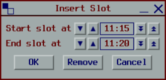
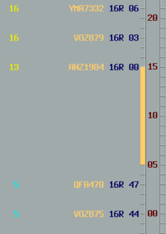

# Slots

Slots reserve runway capacity by preventing flights from being scheduled during a specific time period. They are used for special operations, configuration changes, or other reasons requiring a gap in arrivals.

For how slots affect sequencing, see [Sequencing - Slots](../system-overview/03-sequencing.md#slots).

## Creating a Slot

1. Right-click on the ladder in a runway view
2. Select `Insert Slot`
3. Adjust the start and end times
4. Click `OK`

The slot appears on the ladder. Any non-frozen flights within the slot are delayed until after the slot ends.

<!-- TODO: Add a better screenshot with an actual delay -->

## Modifying a Slot

1. Left-click the slot on the ladder
2. Adjust the start and end times
3. Click `OK`

## Removing a Slot

1. Left-click the slot on the ladder
2. Click `Remove`
